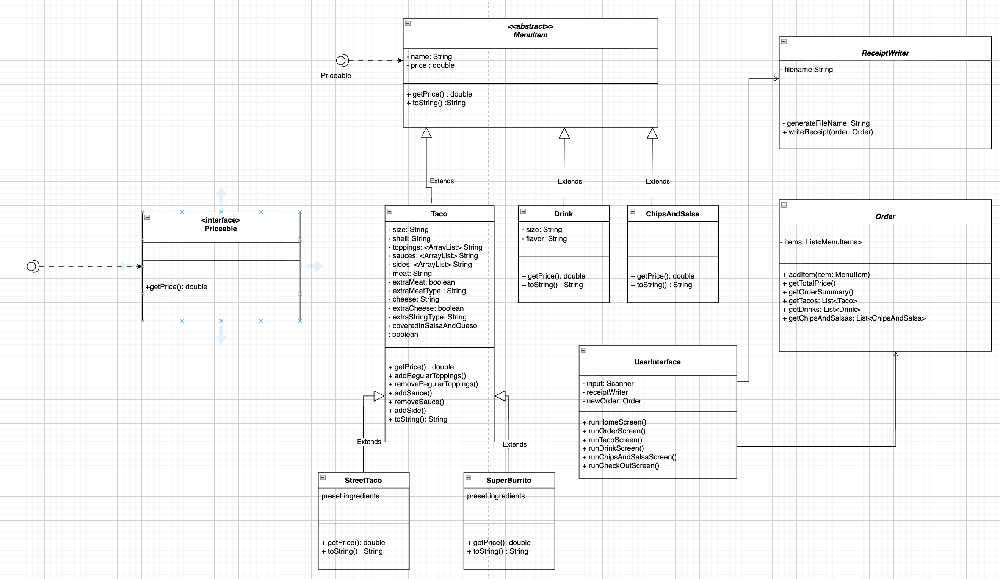

# Sunset Taco
A Java console application for ordering tacos, drinks, and chips & salsa at Sunset Taco. Customers can build their own custom taco or choose from signature options, customize toppings, sauces, sides, and more — then check out and receive a timestamped receipt file.
## Class Design

## Features
- Order signature tacos (Street Taco or Super Burrito) or build your own taco
- Customize meat, cheese, toppings, sauces, sides, and salsa/queso cover
- Add drinks (Small / Medium / Large) with flavor and chips & salsa
- View a live order summary at any time
- Checkout generates a timestamped `.txt` receipt saved to a `receipts` folder
- Cancel order at any time
## Project structure

```
src/main/java/com/pluralsight/
src/main/java
└── com
    └── pluralsight
        ├── App.java
        ├── data
        │   └── ReceiptWriter.java
        ├── models
        │   ├── ChipsAndSalsa.java
        │   ├── Drink.java
        │   ├── MenuItem.java
        │   ├── Order.java
        │   ├── Priceable.java
        │   ├── StreetTaco.java
        │   ├── SuperBurrito.java
        │   └── Taco.java
        ├── ui
        │   └── UserInterface.java
        └── util
            └── AnsiColors.java
```
## Technical HighLights
- Designed and developed a Java-based Taco Shop POS system supporting customizable tacos, signature menu items, drinks, and sides.
- Applied Object-Oriented Programming (OOP) principles including encapsulation, inheritance, and polymorphism.
- Designed an inheritance hierarchy with specialized menu items such as StreetTaco and SuperBurrito extending the base Taco class.
- Implemented interfaces to support a flexible order-item architecture for tacos, drinks, and chips.
- Implemented file-based receipt generation using Java I/O (FileWriter, BufferedWriter) and Java Time API. 
- Utilized collections (ArrayList) to manage toppings, sauces, sides, and order items.
- Handling input validation error handling to improve user experience and prevent invalid orders.
- Created UML diagrams and system design documentation to model application architecture.
- Created Unit test cases for Taco order management, and pricing calculations.

## How to Run
1. Clone the repository
    ```bash
   git clone https://github.com/jolienguyen0831/sunset-taco.git
   ```
2. Open the project in IntelliJ
3. Run `App.java`
5. Follow on-screen prompts to interact with the system

##
### Interesting code

``` java
private Taco buildTacoByType(String tacoType) {
        if (tacoType.equals("street")) {
            return new StreetTaco();
        }
        if (tacoType.equals("super"))  {
            return new SuperBurrito();
        }
        //Custom taco
        while (true) {
            String size = promptSizeSelection();
           
            if (size.equals("return")){
            //exit the taco screen
                System.out.println("\nReturning to home screen...");
                return null;
            }
            String shell = promptShellSelection();
            
            if (shell.equals("return")) {
            // return size screen without cancelling
                System.out.println("\nReturning to size selection...");
                continue;
            }
            return new Taco(size, shell);
        }
    }
```
## Receipt output

Each receipt file is named by timestamp:
`(receipts/20260529-034448.txt)`

Example
```
          SUNSET TACO Receipt
=======================================

========================================
              ORDER SUMMARY
========================================

Item #1 Drink
Size   : Large
Flavor : Coke
Price  : $3.00

Item #2 	 Street Taco (Signature) 	
Taco
Size: 3-Taco Plate
Shell: Corn
Meat: Carne Asada (Extra Al Pastor)
Cheese: None (Extra Cotija)
Regular Toppings:  - Onions  - Cilantro
Sauces:  - Salsa Verde
Sides:  - Lime Wedges  - Lime Wedges  - Crema
Covered in Salsa & Queso: YES
Price  : $14.10

_______________________________________
SUBTOTAL    : $17.10
TAX (8.25%) : $1.41
TOTAL       : $18.51

Thank you for your order!
```
## Future Improvements

- Refactor additional sections of the codebase to further reduce duplication and improve maintainability.
- Create an employee/admin dashboard for viewing sales reports and order history.
- Generate detailed sales analytics and daily revenue reports.

